# LoRa connectivity for Cumulocity

## Installing Cumulocity LoRa plugin

You can install the Cumulocity LoRa plugin from the administration app, it should be available in the Ecosystem -> Applications -> Packages menu.

If not, download the zip file from the latest release and install it in the application packages (available from the menu pointed above): https://github.com/SoftwareAG/cumulocity-lora/releases/latest/download/sag-ps-iot-pkg-lora-package.zip

It is intended to be installed in devicemanagement application only.

This plugin requires the microservice feature enabled on your tenant to work. If you're on a trial tenant please contact your sales representative to do so, or contact support on Empower.

Once microservice feature is enabled, please install the github-proxy microservice that can be downloaded from this URL: https://github.com/SoftwareAG/cumulocity-lora/releases/latest/download/github-proxy.zip

When the github-proxy microservice is installed, just go to devicemanagement application, then to lora/config menu.
From there just select the microservices you want to install on your tenant.

You'll see 2 kinds of microservices: LNS connectors, usually named lora-ns-, and codecs, usually named lora-codec-

## User documentation

### Adding a new LNS connector

In devicemanagement-lora application go to menu LoRa/LoRa network servers.
Simply give a name to your connector, then select the type of LNS you want to connect to (the type you're looking for will only show up if the corresponding microservice is installed).

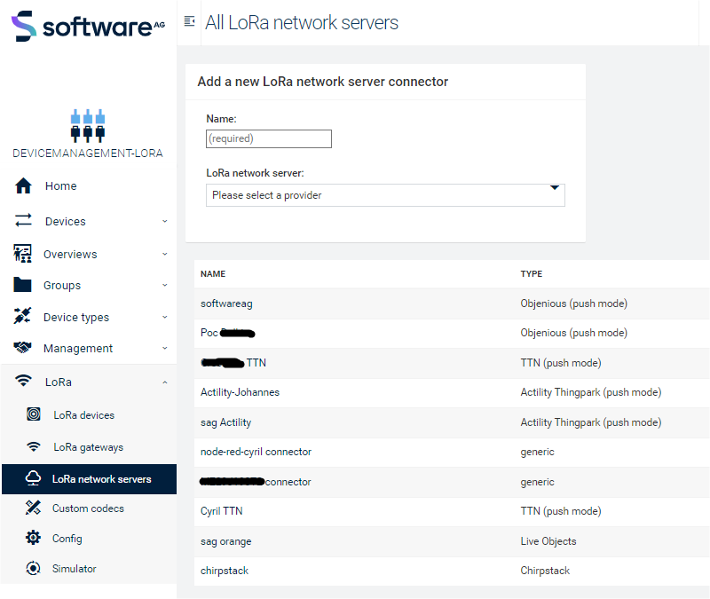

Ensure that le LNS you want to connect to Cumulocity is properly configured (some LNS require the creation of an API key for instance).
Once the type is selected, simply follow the wizard instructions.
Already provisioned devices will be automatically added to Cumulocity once they send data and their data are forwarded by the LNS to Cumulocity.
Example for TTN:

And another for Chirpstack:

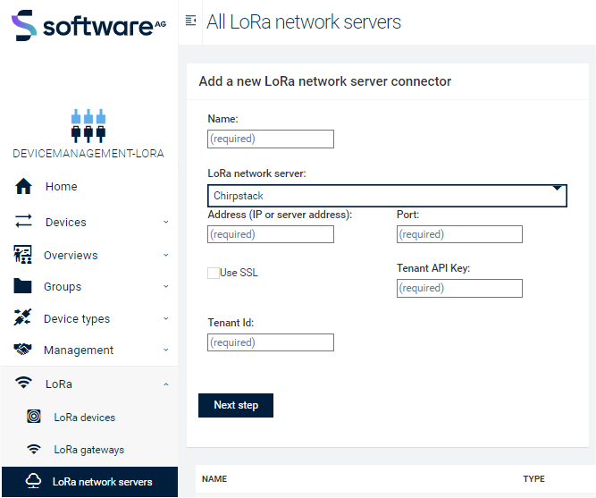

### Automatic device import

Once the connector is created, Cumulocity will automatically create an HTTP route in the LNS to push data from the LNS to the current Cumulocity tenant.
Moreover, all existing devices in the LNS will be automatically created in Cumulocity once they send data and data are pushed to Cumulocity through the configured HTTP route. Those devices will be created without a codec associated to them, you will therefore need to go to the device detailed view in order to choose the right codec.
Any payload sent to Cumulocity priori codec selection won't be lost: they will be stored and you will be able to process them once you have chosen the right codec.

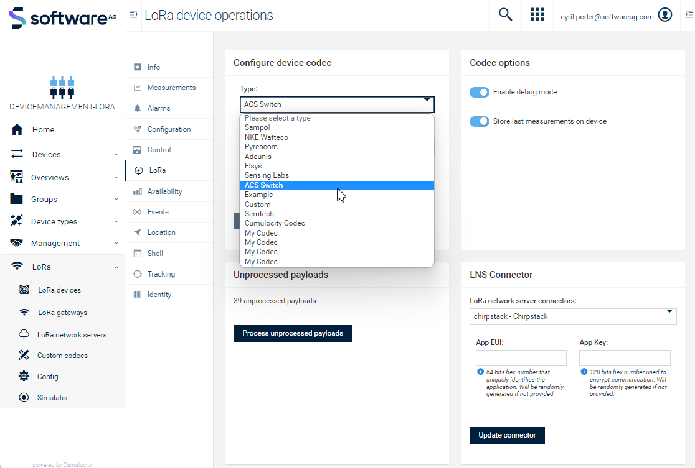

### Provisioning new LoRa devices

In devicemanagement-lora application go to menu LoRa/LoRa devices.

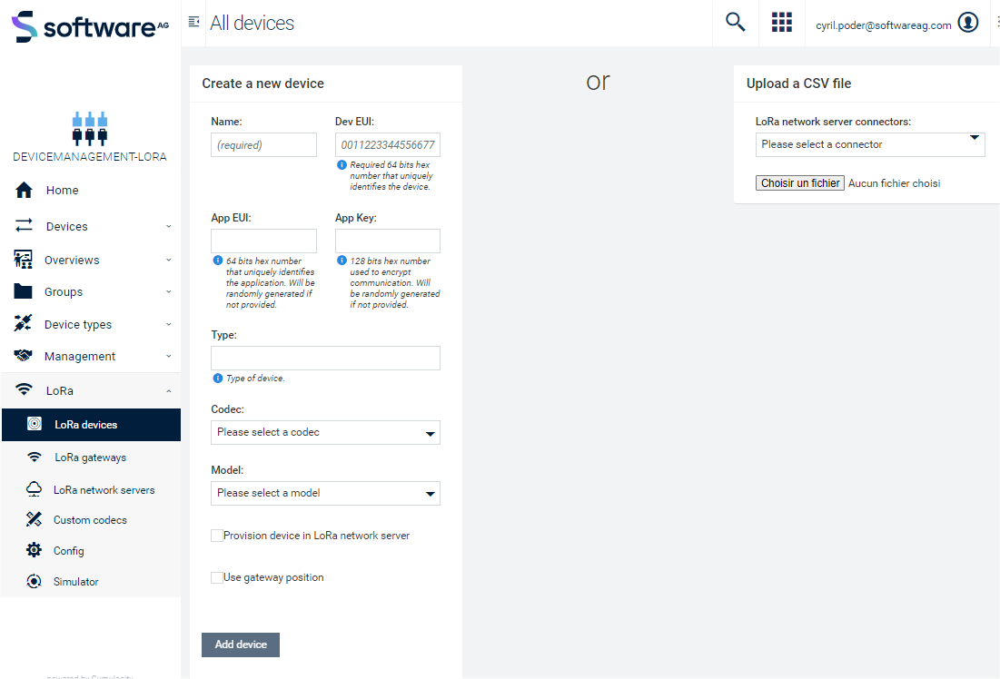

In order to provision the device in an LNS, you need to check the box labeled "Provision device in LoRa network server": you will then be able to choose the LNS connector related to the LNS you want to provision the device into.
Depending on the type of LNS connector you choose, different fields will appear to finalise the device provisioning in that specific LNS.

Example for TTN:

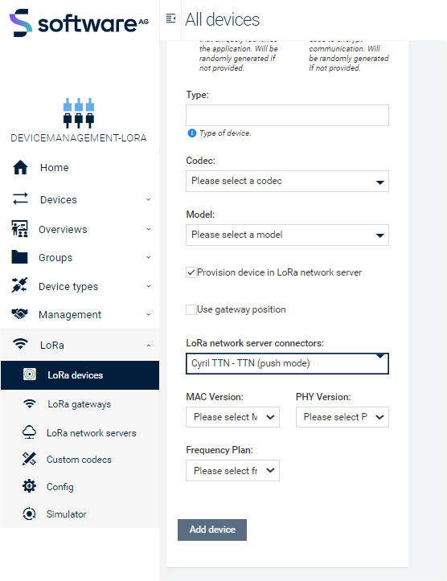

And another for Chirpstack:

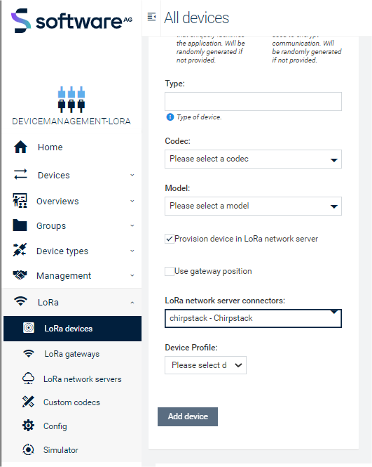

### Provisioning new gateways

In devicemanagement-lora application go to menu LoRa/LoRa gateways.

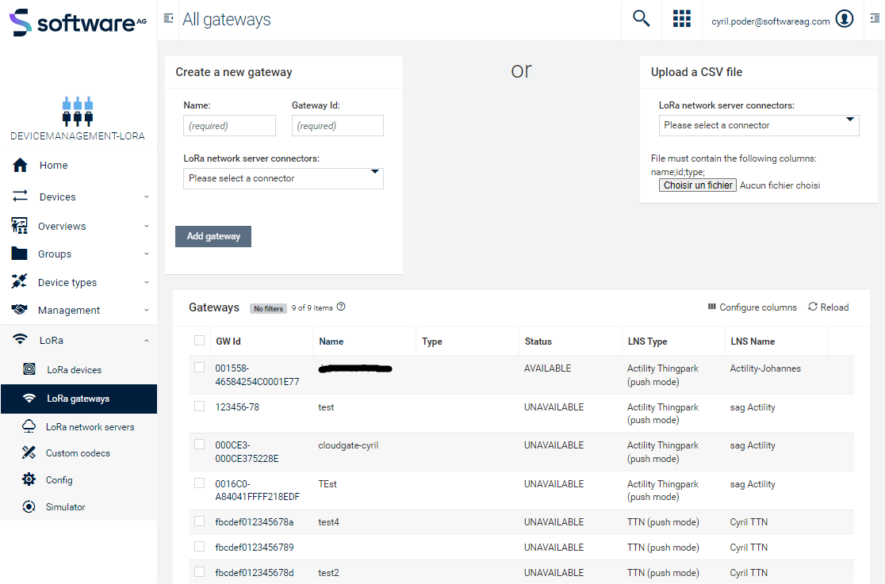

Depending on the LNS connector you will choose, different fields will appear.

Example with TTN:

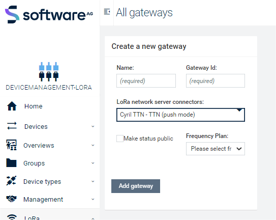

Another with Actility:

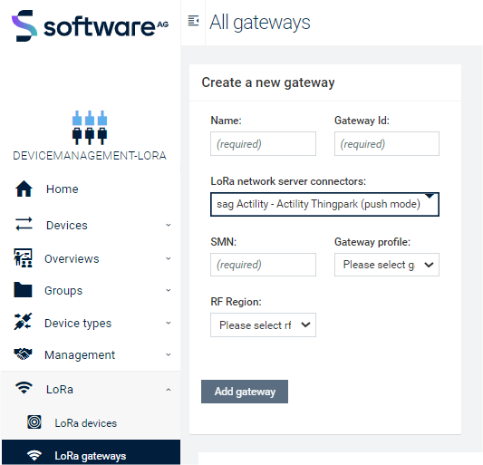

In order to be able to provision a gateway, some LNS require specific authorization. For example TTN requires a user API key, as an application API key will only allow you to manage devices in a specific application.

### Device management

LoRa devices, identified by a JSON fragment `lora_ns_device_LoRaDevice`, can be managed from a specific view accessible through the submenu "LoRa" on the device detailed view.

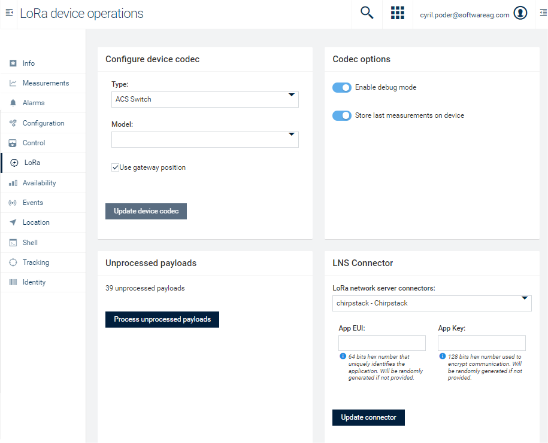

Several actions can be performed in this view:

1. Configure device codec

You can change the codec at any moment. If you select the wrong and it failed to process an incoming payload, the payload will stay in an unprocessed state and you will be able to reprocess it later.

2. Codec options

You can enable debug mode, which will generate a special event for each incoming payload that will contain the full decoded payload.

You can also choose to store the last measurements on the device itself, so you will be able to use them on specific widgets but also to add them as columns in the "all devices" table.

3. Process unprocessed payloads

Devices that are automatically imported won't have a codec configured, and payloads will be stored in an unprocessed state.
You will be able to process them once you have configured a codec.

4. Switch LNS

You can switch a device to another LNS. When doing so the device will be deprovisioned from its current LNS and provisioned to the newly selected LNS.

5. Send commands

Depending on the codec configured on the device, various commands will be available.
Most device will have a command to retrieve their current configuration. When such commands are processed by the device, an uplink containing the device configuration will be received and the configuration will be stored on the device in Cumulocity as a JSON document available in the configuration tab of the device:

You can either update the device configuration by modifying the JSON directly or by sending a command from the LoRa tab. Commands available on the LoRa tab will have their input fields prefilled with the values stored in the device configuration:

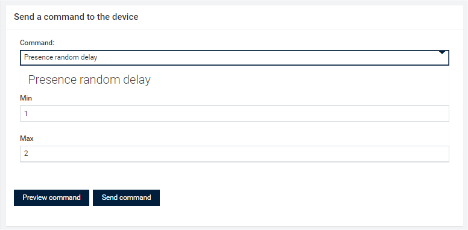

When a command is sent it will go through the usual Cumulocity operation lifecycle:

PENDING -> EXECUTING -> SUCCESS or FAILED

The status of the operation will be updated when the LNS send a downlink update event.

Note that not all LNS support downlink update event or that it as to be switched on explicitely either on the device profile or on the LNS configuration.

### LNS events

All LNS events will be available as events on the LNS connector managed object in their raw JSON format as sent by the LNS.

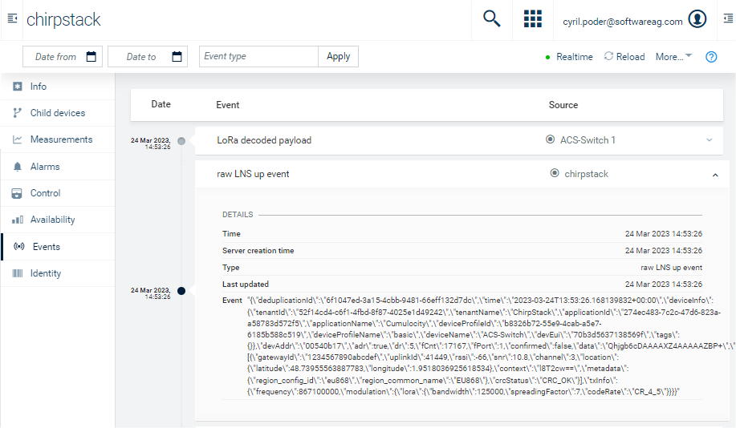

Uplink events will also be available on the devices in a form that contains the fport, the payload in hex format, whether the payload was processed or not and other relevant information.

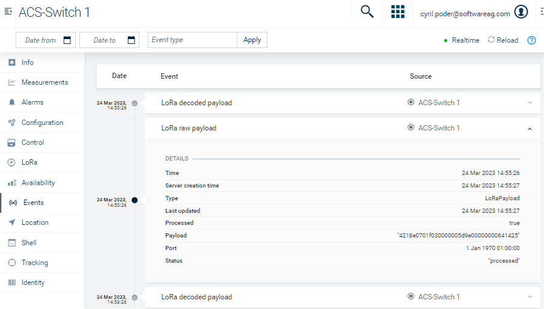

### Codec IDE

The framework offers the ability to quickly build codec directly from Cumulocity UI with an integrated IDE based on Monaco Editor.

To enable this feature you need to install the custom codec microservice `lora-ns-custom`.

The IDE is accessible on LoRa/Custom codecs menu and is devided in 3 parts:

- Uplink processing (decoder)

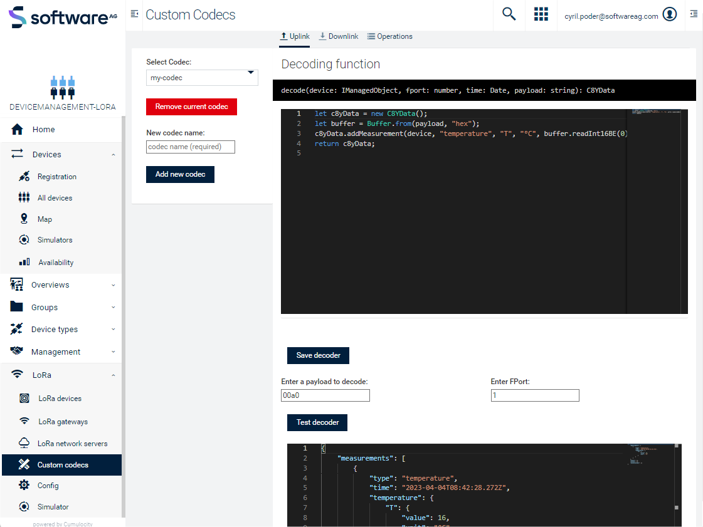

- Downlink processing (encoder)

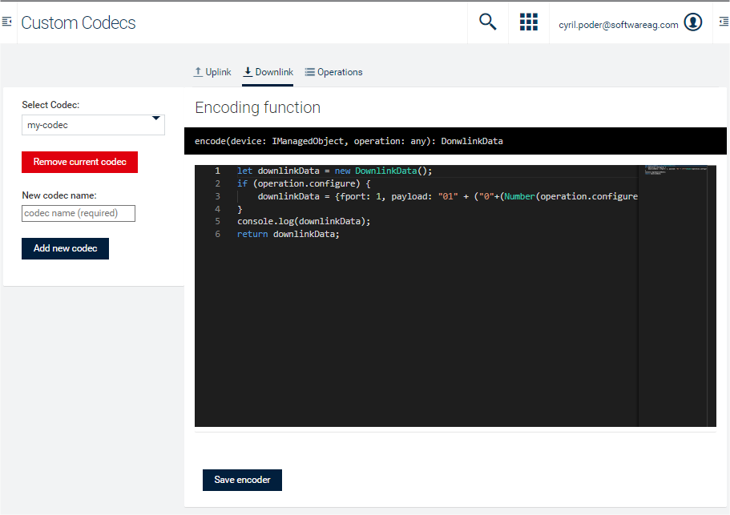

- Operations definition

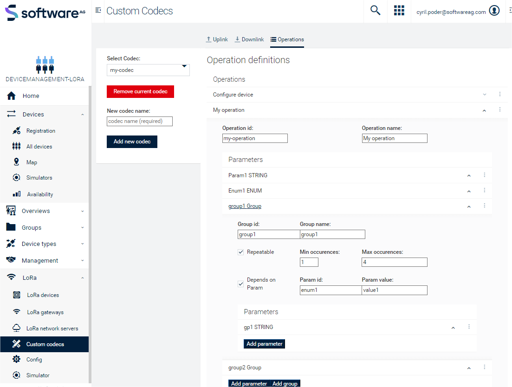

Once you're happy with your codec and you saved it, it will be accessible from any LoRa device Lora tab as a model of the custom codec.
