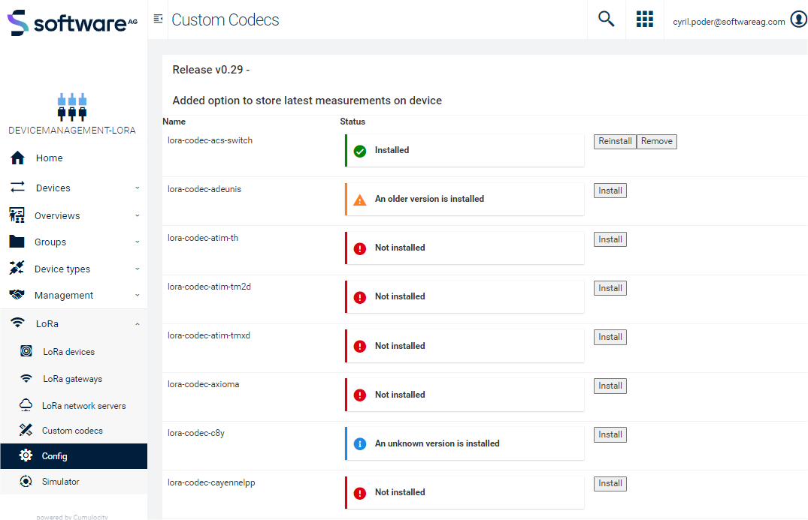

# LoRa connectivity for Cumulocity

## Installation

Download the python script python/install.py.
Script usage is:

```
install.py [-u <username>] [-p <password>] [-h <cumulocity tenant URL>]
```

If a parameter is not provided a prompt will ask you to enter it.
The script might take a while to execute as it will download locally the UI zip and the github-proxy microservice and then install them on your tenant.

Once the script is executed just go to devicemanagement-lora application, then to lora/config menu.
From there just select the microservices you want to install on your tenant.

You'll see 2 kinds of microservices: LNS connectors, usually named lora-ns-, and codecs, usually named lora-codec-


## User documentation

### Adding a new LNS connector

In devicemanagement-lora application go to menu LoRa/LoRa network servers.
Simply give a name to your connector, then select the type of LNS you want to connect to (the type you're looking for will only show up if the corresponding microservice is installed).

Ensure that le LNS you want to connect to Cumulocity is properly configured (some LNS require the creation of an API key for instance).
Once the type is selected, simply follow the wizard instructions.
Already provisioned devices will be automatically added to Cumulocity once they send data and their data are forwarded by the LNS to Cumulocity.
Exemple for TTN:

And another for Chirpstack:


### Provisioning new LoRa devices

In devicemanagement-lora application go to menu LoRa/LoRa devices.

